# Audience Examples by Diagram Type

Ready-to-adapt Mermaid snippets for SWE, DevOps, and Platform Engineering.
`P` = Primary use · `S` = Secondary · `R` = Rare

---

## Flowchart — SWE P · DevOps P · Platform P

**[SWE] API endpoint routing logic**
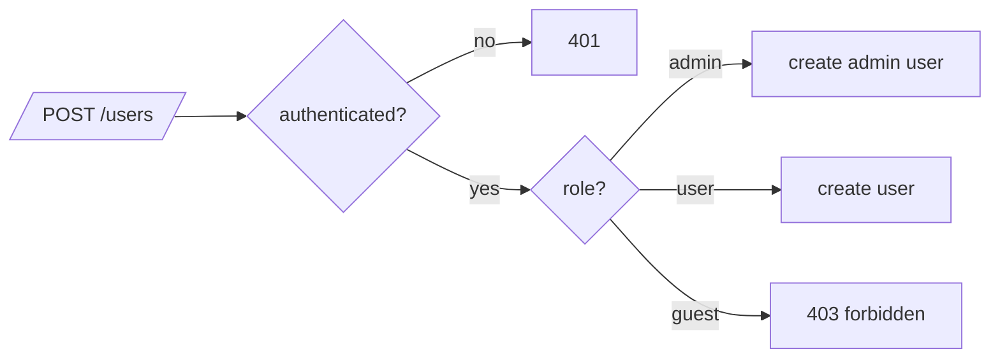

**[DevOps] Deployment pipeline with gates**
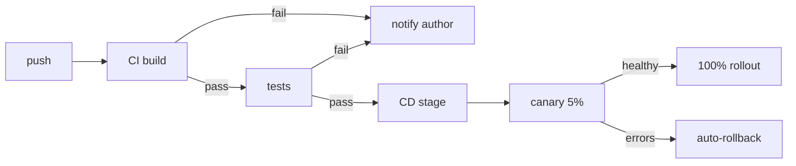

**[Platform] Tenant routing / multi-tenant dispatch**
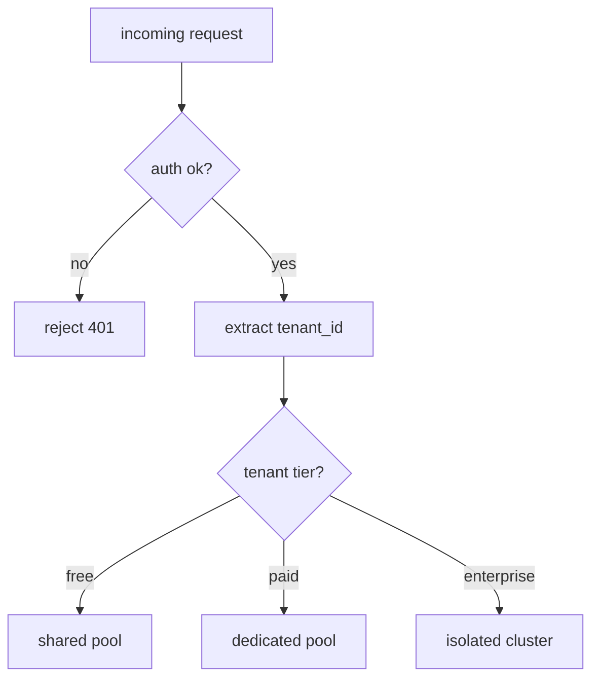

**[Platform] Feature-flag evaluation tree**
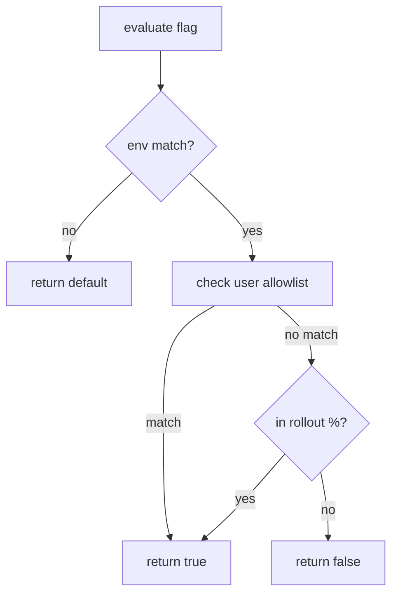

---

## Sequence — SWE P · DevOps P · Platform S

**[SWE] Method call order within a service**
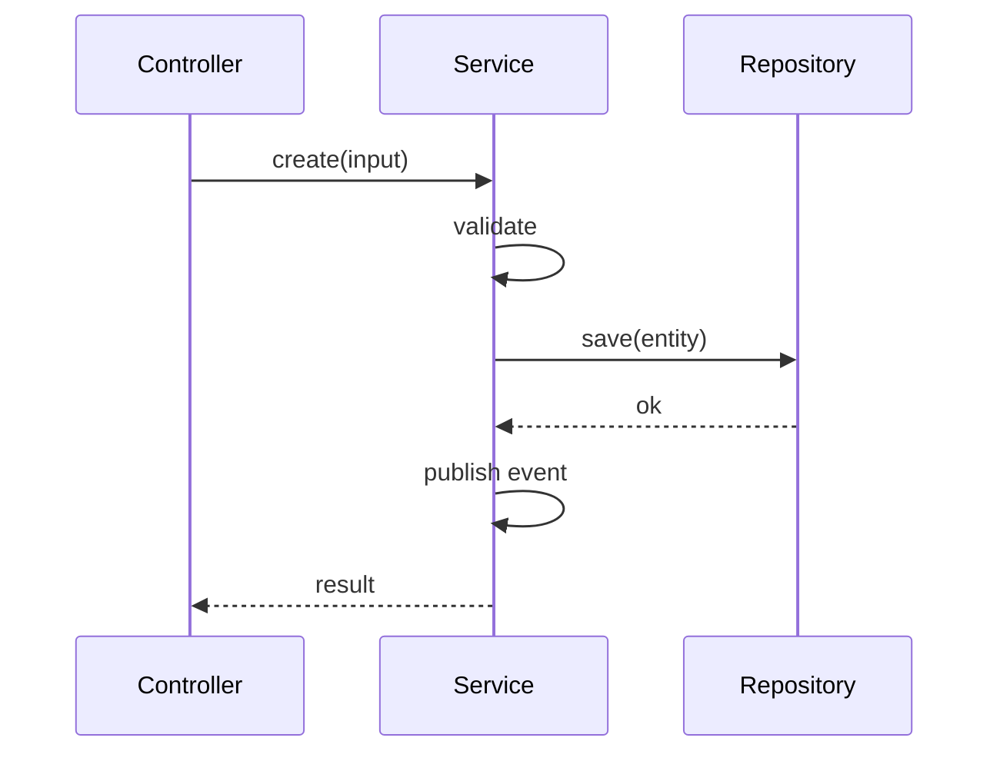

**[SWE] Async webhook fan-out**
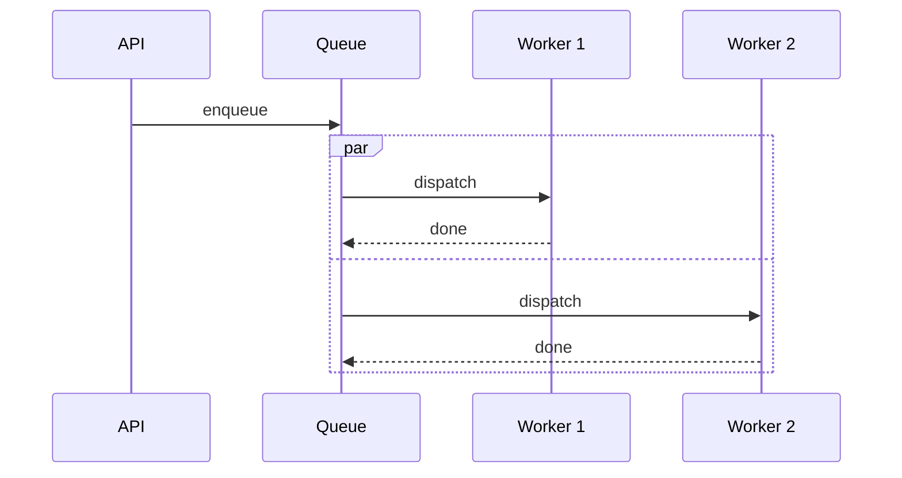

**[DevOps] Distributed request trace with slow DB**
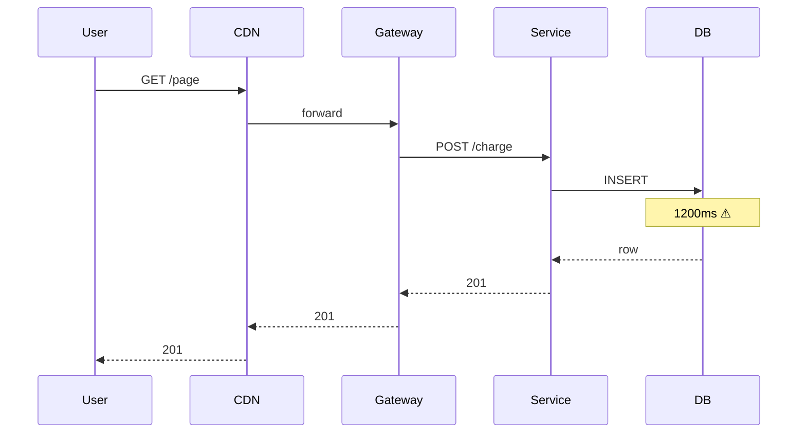

**[Platform] Auth flow across services**
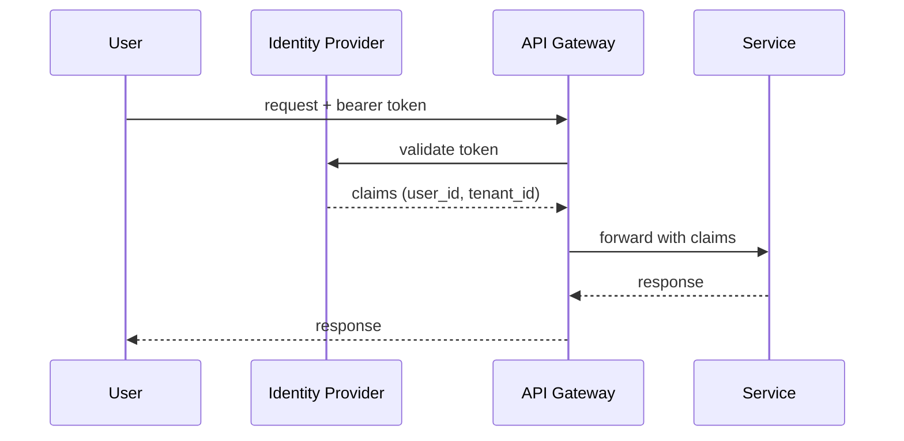

---

## State — SWE P · DevOps P · Platform S

**[SWE] Async job states**
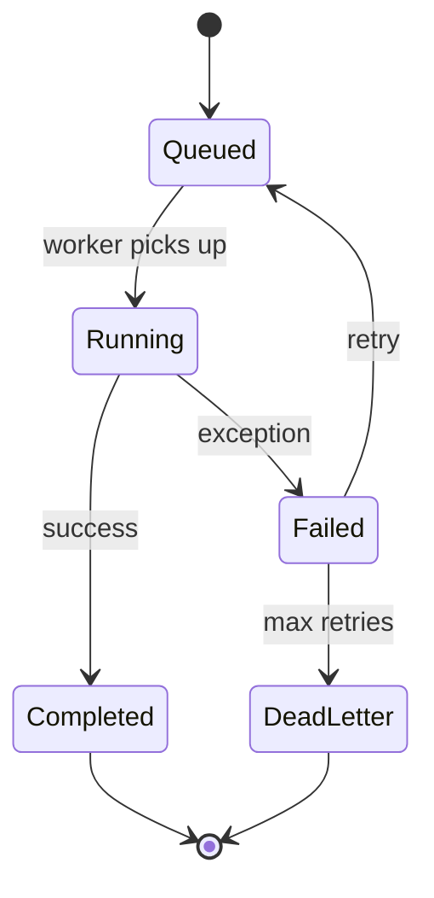

**[DevOps] Deployment rollout states**
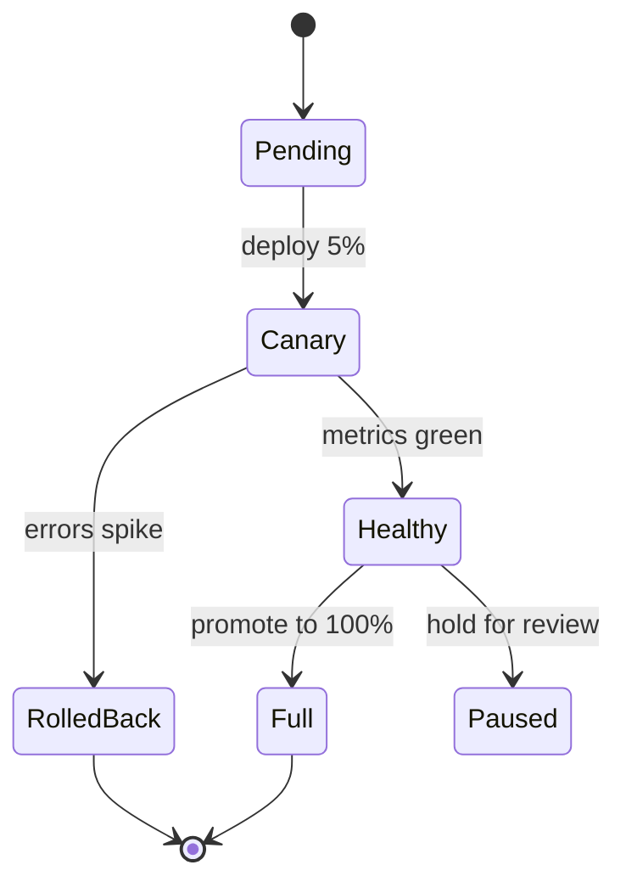

**[Platform] Tenant lifecycle**
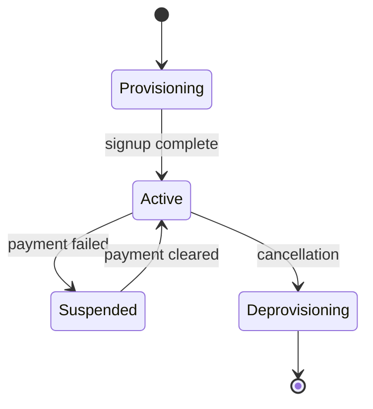

---

## Architecture — SWE R · DevOps P · Platform P

**[DevOps] Three-tier web app on AWS**


**[Platform] Multi-region topology**


---

## C4 — SWE P · DevOps P · Platform P

**[SWE] System context (C4Context)**
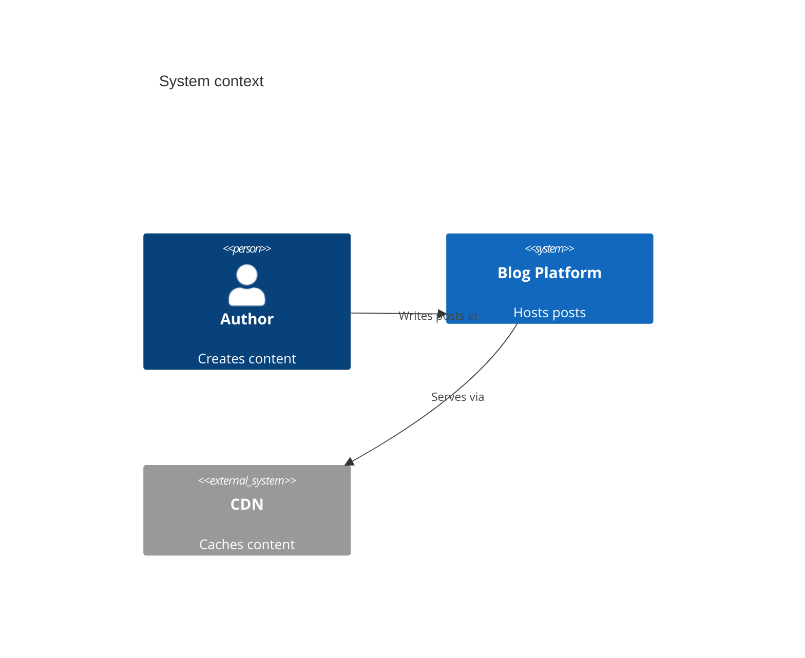

**[DevOps] Container view (C4Container)**
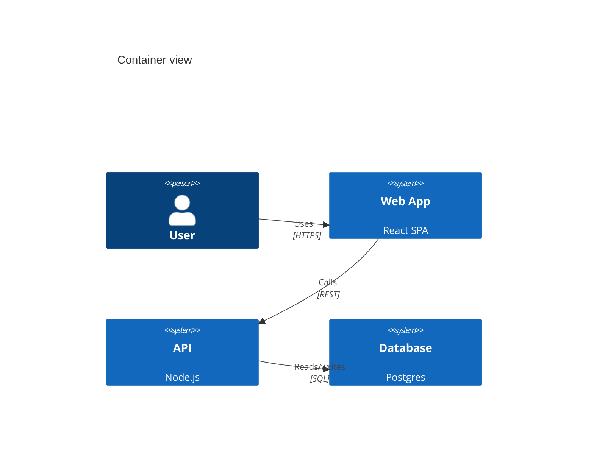

---

## Gantt — SWE S · DevOps P · Platform P

**[DevOps] Maintenance window**
```mermaid
gantt
    title DB upgrade window
    dateFormat HH:mm
    axisFormat %H:%M
    section Prep
    Snapshot     :done, snap, 02:00, 10m
    section Upgrade
    Apply        :crit, apply, 02:10, 30m
    Verify       :active, verify, 02:40, 15m
    section Cutover
    Failover     :crit, fo, 02:55, 5m
    Monitor      :done, mon, 03:00, 60m
```

**[Platform] Q3 roadmap**
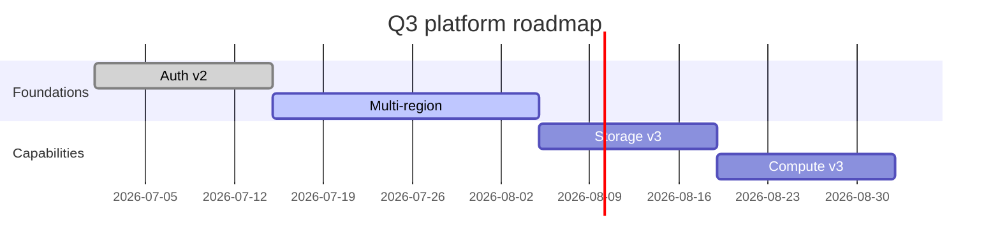

---

## Gitgraph — SWE P · DevOps P · Platform P

**[DevOps] Hotfix off release branch**
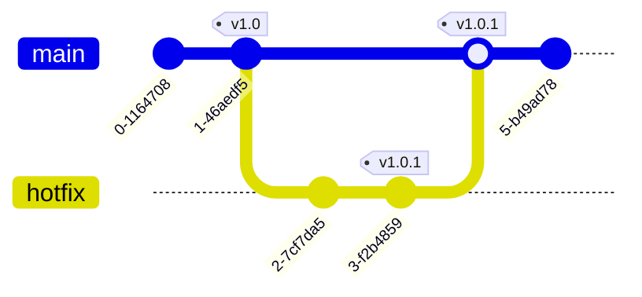

**[Platform] SDK versioning with parallel majors**
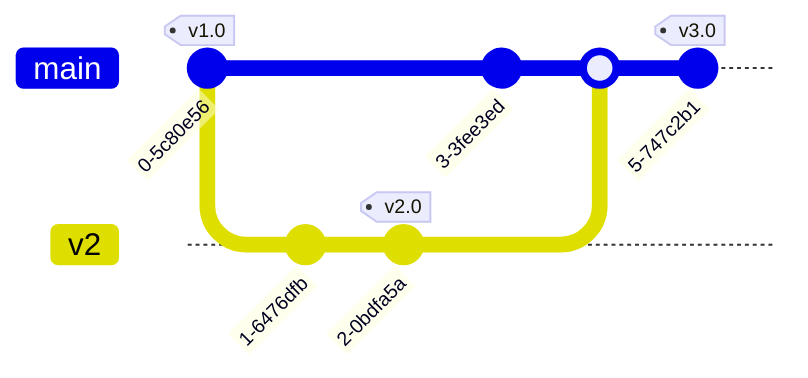

---

## XY Chart — SWE S · DevOps P · Platform P

**[DevOps] p99 latency over 24 hours**
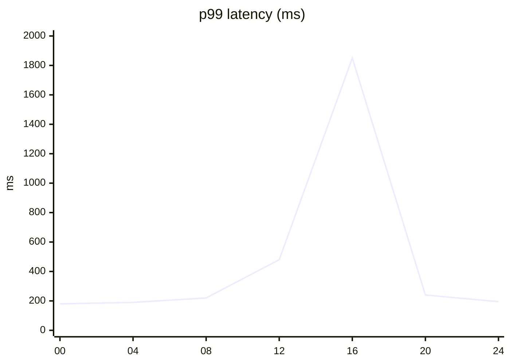

**[DevOps] Error rate by service**
```mermaid
xychart-beta
    title "Error rate (%)"
    x-axis [api, web, auth, pay, db]
    y-axis "%" 0 --> 5
    bar [0.4, 0.1, 0.2, 1.8, 0.3]
```

**[Platform] Tenant growth over 12 months**
```mermaid
xychart-beta
    title "Active tenants"
    x-axis [Jan, Feb, Mar, Apr, May, Jun, Jul, Aug, Sep, Oct, Nov, Dec]
    y-axis "Tenants" 0 --> 500
    bar [120, 145, 180, 210, 240, 280, 310, 340, 380, 410, 450, 480]
```

---

## Sankey — SWE S · DevOps P · Platform P

**[DevOps] Cloud cost attribution**
```mermaid
sankey-beta
    Compute,API,1200
    Compute,Web,800
    Compute,Workers,400
    Storage,DB,600
    Storage,Cache,200
    Network,CDN,300
```

**[Platform] Resource distribution across tenants**
```mermaid
sankey-beta
    Pool,Acme,400
    Pool,Beta,250
    Pool,Gamma,150
    Pool,Delta,100
    Pool,Free,100
    Acme,Compute,250
    Acme,Storage,150
    Beta,Compute,180
    Beta,Storage,70
```

---

## Radar — SWE S · DevOps P · Platform P (v11.6.0+)

**[SWE] Code quality across services**
```mermaid
radar-beta
    axis Coverage, Complexity, Duplication, Coupling, TestSpeed
    curve auth { 85, 30, 12, 20, 90 }
    curve pay  { 70, 55, 25, 45, 60 }
    curve web  { 60, 40, 30, 50, 75 }
```

**[Platform] Platform capability coverage (today vs target)**
```mermaid
radar-beta
    axis Auth, Storage, Compute, Network, Observability, Compliance
    curve today  { 80, 90, 70, 60, 85, 75 }
    curve target { 95, 95, 90, 90, 95, 95 }
```

---

## Quadrant — SWE S · DevOps P · Platform P

**[SWE] Tech debt backlog (impact vs effort)**
```mermaid
quadrantChart
    title Tech debt backlog
    x-axis Low effort --> High effort
    y-axis Low impact --> High impact
    quadrant-1 Quick wins
    quadrant-2 Strategic
    quadrant-3 Ignore
    quadrant-4 Reconsider
    AuthRefactor:   [0.2, 0.8]
    DBMigration:    [0.7, 0.9]
    LoggingCleanup: [0.3, 0.3]
    DocUpdate:      [0.8, 0.2]
```

**[DevOps] Service health (latency vs error rate)**
```mermaid
quadrantChart
    title Service health
    x-axis Low latency --> High latency
    y-axis Low errors --> High errors
    quadrant-1 Critical
    quadrant-2 Slow but stable
    quadrant-3 Healthy
    quadrant-4 Fast but flaky
    api:   [0.7, 0.8]
    auth:  [0.3, 0.2]
    db:    [0.9, 0.4]
    cache: [0.2, 0.1]
```

---

## Mindmap — SWE P · DevOps S · Platform P

**[Platform] Platform capabilities map**
```mermaid
mindmap
    root((Platform))
        Storage
          Object
          Block
          DB
        Compute
          Containers
          Functions
          VMs
        Network
          VPC
          CDN
          DNS
        Observability
          Metrics
          Traces
          Logs
```

**[DevOps] Incident investigation tree**
```mermaid
mindmap
    root((Latency spike))
        Code
          Recent deploy
          Profile
        Infra
          DB
          Cache
          Network
        Data
          Volume
          Query plan
```

---

## ER — SWE P · DevOps S · Platform S

**[SWE] E-commerce schema**
```mermaid
erDiagram
    USER ||--o{ ORDER : places
    ORDER ||--|{ LINE_ITEM : contains
    PRODUCT ||--o{ LINE_ITEM : appears_in
    USER {
        uuid id PK
        string email UK
    }
    ORDER {
        uuid id PK
        uuid user_id FK
        timestamp created_at
    }
```

**[Platform] Tenant data isolation model**
```mermaid
erDiagram
    TENANT ||--o{ TENANT_USER : has
    TENANT ||--|{ TENANT_DATA : owns
    TENANT_USER {
        uuid tenant_id FK
        uuid user_id FK
        string role
    }
    TENANT_DATA {
        uuid id PK
        uuid tenant_id FK
        jsonb payload
    }
```

---

## Requirement — SWE R · DevOps S · Platform P

**[Platform] SLA definition**
```mermaid
requirementDiagram
    requirement api_sla {
        id: 1
        text: 99.9% uptime monthly
        risk: high
        verifyMethod: measurement
    }
    functionalRequirement response_time {
        id: 2
        text: p99 < 500ms
    }
    api_sla - contains -> response_time
```

---

## Common doc × diagram combos

| Doc type | Diagram set |
|----------|-------------|
| PR description | flowchart (ownership) + sequence (hot path) + stateDiagram (lifecycle) |
| ADR / RFC | C4Context + flowchart before/after + migration path |
| Incident review | gantt (timeline) + sequence (trace) + flowchart (mitigation) |
| Runbook | flowchart (decision tree) + sequence (commands) + kanban (status) |
| SLO doc | flowchart (SLO tree) + xychart (history) + radar (multi-SLO) |
| Platform RFC | C4Container + architecture-beta + sankey (cost/resource) |
| Capacity plan | xychart (trend) + gantt (roadmap) + quadrant (priority) |
| Onboarding doc | mindmap (capabilities) + C4Context + sequence (auth flow) |
| Roadmap | timeline (milestones) + gantt (phased) + kanban (in-flight) |
