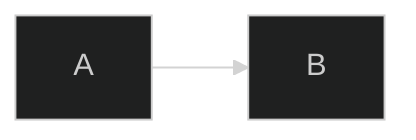

# Diagram Options — All 19 Types

All available Mermaid diagram types with use cases, audience tags, and official
documentation links.

**GitHub repo:** https://github.com/mermaid-js/mermaid  
**Live editor (zero-install):** https://mermaid.live  
**Official docs root:** https://mermaid.js.org/syntax/  
**Current version:** `mermaid@11.16.0`

`P` = Primary · `S` = Secondary · `R` = Rare (for SWE / DevOps / Platform)

---

## Interaction diagrams

### Flowchart
**Keyword:** `flowchart` (alias: `graph`)  
**When:** Decisions, processes, workflows, routing logic, pipelines, feature-flag
evaluation, layered ownership. The default choice — reach for this first.  
**Audience:** SWE P · DevOps P · Platform P  
**Docs:** https://mermaid.js.org/syntax/flowchart.html

### Sequence
**Keyword:** `sequenceDiagram`  
**When:** Interactions over time between services or actors — API calls, auth
flows, request traces, async fan-out, incident alert chains.  
**Audience:** SWE P · DevOps P · Platform S  
**Docs:** https://mermaid.js.org/syntax/sequenceDiagram.html

### State
**Keyword:** `stateDiagram-v2`  
**When:** Object or job lifecycle — cache entries, async jobs, deployments,
tenant provisioning, health-check states.  
**Audience:** SWE P · DevOps P · Platform S  
**Docs:** https://mermaid.js.org/syntax/stateDiagram.html

---

## Structure diagrams

### Class
**Keyword:** `classDiagram`  
**When:** OO domain model, type hierarchies, service interface contracts,
tooling taxonomy.  
**Audience:** SWE P · DevOps S · Platform S  
**Docs:** https://mermaid.js.org/syntax/classDiagram.html

### ER (Entity-Relationship)
**Keyword:** `erDiagram`  
**When:** Database schema, data model, tenant isolation model.  
**Audience:** SWE P · DevOps S · Platform S  
**Docs:** https://mermaid.js.org/syntax/entityRelationshipDiagram.html

### C4
**Keywords:** `C4Context` / `C4Container` / `C4Component` / `C4Dynamic`  
**When:** System architecture at four zoom levels. Use `C4Context` for a
cross-team / cross-system view; `C4Container` to show services; `C4Component`
for internals of one service.  
**Audience:** SWE P · DevOps P · Platform P  
**Docs:** https://mermaid.js.org/syntax/c4.html

### Architecture
**Keyword:** `architecture-beta` *(v11.1.0+)*  
**When:** Cloud service topology with AWS-style icons — groups, services,
regions, inter-service connections.  
**Audience:** SWE R · DevOps P · Platform P  
**Docs:** https://mermaid.js.org/syntax/architecture.html

### Block
**Keyword:** `block-beta`  
**When:** Custom grid layouts — tenant × capability matrices, dashboard
structures, UI screen layouts.  
**Audience:** SWE S · DevOps S · Platform P  
**Docs:** https://mermaid.js.org/syntax/block.html

### Requirement
**Keyword:** `requirementDiagram`  
**When:** Formal requirement specs, SLA decomposition, compliance traceability.  
**Audience:** SWE R · DevOps S · Platform P  
**Docs:** https://mermaid.js.org/syntax/requirementDiagram.html

---

## Time & history

### Gantt
**Keyword:** `gantt`  
**When:** Project / initiative schedule with task dependencies, maintenance
windows, phased rollouts, quarterly roadmaps.  
**Audience:** SWE S · DevOps P · Platform P  
**Docs:** https://mermaid.js.org/syntax/gantt.html

### Timeline
**Keyword:** `timeline`  
**When:** Year-level milestones, release history, platform capability evolution.
Broader strokes than Gantt — no task dependencies.  
**Audience:** SWE S · DevOps P · Platform S  
**Docs:** https://mermaid.js.org/syntax/timeline.html

### Gitgraph
**Keyword:** `gitGraph`  
**When:** Git branching strategy, hotfix flows, SDK versioning with parallel
major branches, coordinated cross-repo branching.  
**Audience:** SWE P · DevOps P · Platform P  
**Docs:** https://mermaid.js.org/syntax/gitgraph.html

---

## Data visualization

### XY Chart
**Keyword:** `xychart-beta`  
**When:** Time-series or categorical numerical data — p99 latency trends, error
rates by service, tenant growth over months, build time history.  
**Audience:** SWE S · DevOps P · Platform P  
**Docs:** https://mermaid.js.org/syntax/xyChart.html

### Sankey
**Keyword:** `sankey-beta`  
**When:** Weighted flows — cost attribution by service, resource distribution
across tenants, request distribution by endpoint.  
**Audience:** SWE S · DevOps P · Platform P  
**Docs:** https://mermaid.js.org/syntax/sankey.html

### Radar
**Keyword:** `radar-beta` *(v11.6.0+)*  
**When:** Multi-axis comparison — code quality across services, service health
across RED signals, platform capability coverage vs target.  
**Audience:** SWE S · DevOps P · Platform P  
**Docs:** https://mermaid.js.org/syntax/radar.html

### Pie
**Keyword:** `pie`  
**When:** Proportional breakdown — cloud cost split, time spent by incident
category, resource share by tenant.  
**Audience:** SWE R · DevOps S · Platform S  
**Docs:** https://mermaid.js.org/syntax/pie.html

---

## Organization

### Mindmap
**Keyword:** `mindmap`  
**When:** Hierarchical brainstorm — feature decomposition, platform capabilities
map, incident investigation tree.  
**Audience:** SWE P · DevOps S · Platform P  
**Docs:** https://mermaid.js.org/syntax/mindmap.html

### Quadrant
**Keyword:** `quadrantChart`  
**When:** 2-axis prioritization — impact vs effort for tech debt, latency vs
error rate for service health, adoption vs value for capabilities.  
**Audience:** SWE S · DevOps P · Platform P  
**Docs:** https://mermaid.js.org/syntax/quadrantChart.html

### Kanban
**Keyword:** `kanban`  
**When:** Work items moving through stages — sprint board, incident queue,
platform request tracker.  
**Audience:** SWE P · DevOps P · Platform P  
**Docs:** https://mermaid.js.org/syntax/kanban.html

---

## Other

### Packet
**Keyword:** `packet-beta` *(v11.0.0+)*  
**When:** Bit-level wire formats and protocol headers — HTTP/2 frame layout,
JWT structure, auth token envelope.  
**Audience:** SWE P · DevOps R · Platform R  
**Docs:** https://mermaid.js.org/syntax/packet.html

---

## Configuration and theming

**Docs:** https://mermaid.js.org/config/configuration.html  
**Theming:** https://mermaid.js.org/config/theming.html

Frontmatter `config:` block (preferred over deprecated `%%{init}%%`):

Built-in themes: `default` · `dark` · `forest` · `neutral` · `base`

---

## Platform support

| Platform | Native Mermaid? | Notes |
|----------|----------------|-------|
| GitHub | ✅ | Most types; some `-beta` types may not render |
| GitLab | ✅ | Broad support via Kroki |
| Notion | ✅ | `mermaid` code block |
| Obsidian | ✅ | All standard types |
| VS Code | ✅ with extension | "Markdown Preview Mermaid Support" |
| Slack / Discord | ❌ | Paste screenshot or use a bot |
| Confluence | via plugin | "Mermaid Diagrams for Confluence" |

When targeting GitHub specifically, test `-beta` diagram types with `mmdc`
first, then verify the rendered result on github.com — fall back to `flowchart`
if the type isn't supported yet.
