# Documentation Patterns

Worked examples of the 7 patterns for composing diagrams in PRs, ADRs, and RFCs.
Running example: **adding a response cache layer behind a feature flag**.

---

## Pattern 1 — Layered ownership

**Question:** *Who owns what code? Which layer does what?*

Use when introducing a new layer between existing ones. Subgraphs = ownership boundaries.

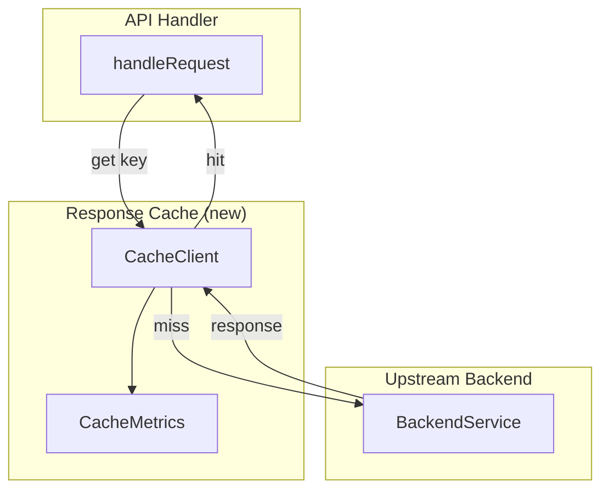

**Anti-pattern:** a flat list of nodes without subgraphs — readers can't tell who owns what.
**Note:** subgraph `direction` is overridden when any node inside connects outside. Set direction on the parent.

---

## Pattern 2 — Data flow / transformation

**Question:** *What does the data look like at each step?*

Use for request-shape transformations, key derivation, normalization pipelines. Always include branch labels so both outcomes are visible.

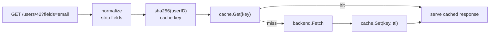

**Anti-pattern:** a single node labeled "process request" — that's where the interesting transformations live.

---

## Pattern 3 — Async fan-in / dedupe

**Question:** *What happens when N callers arrive at once?*

Use for caches, request coalescers, async job dispatchers. `par/and` shows concurrent callers; `alt/else` shows branch outcomes.

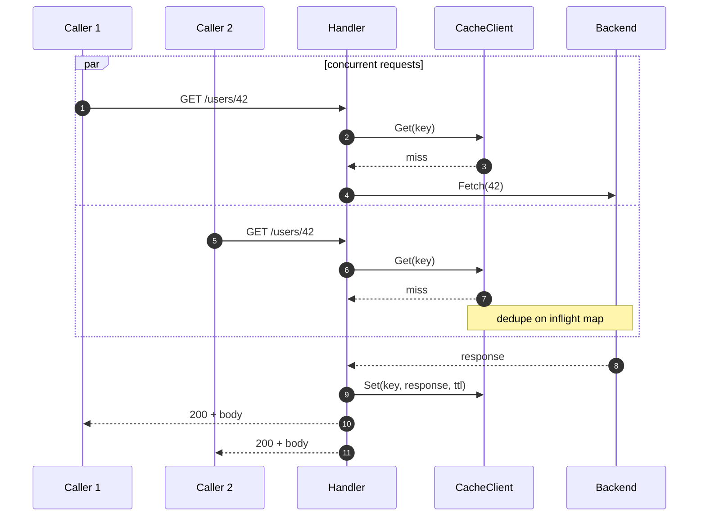

**Note:** `par/and` branches *share* the rest of the diagram — only the inside of `par` is concurrent.

---

## Pattern 4 — Before / after

**Question:** *What changed?*

Use dotted edges (`-.->`) for *new* paths, solid for *existing*. The visual contrast makes the change scannable.

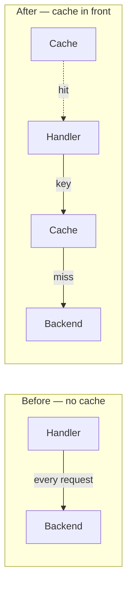

**Anti-pattern:** drawing only the "after" state — readers see the new design but miss what was replaced.

---

## Pattern 5 — Config evolution

**Question:** *How is config structured, and which container owns which resource?*

Use for config refactors, coupling fixes, resource boundary changes.

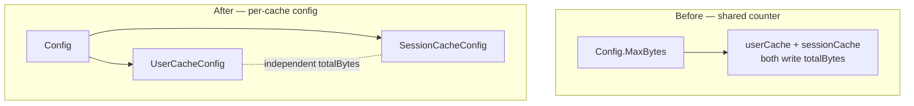

**Anti-pattern:** listing config keys as bullets — the diagram shows what depends on what.

---

## Pattern 6 — Object lifecycle

**Question:** *What states does this object live in?*

Use `stateDiagram-v2` for objects with more than two states — cache entries, jobs, deployments, connections, requests.

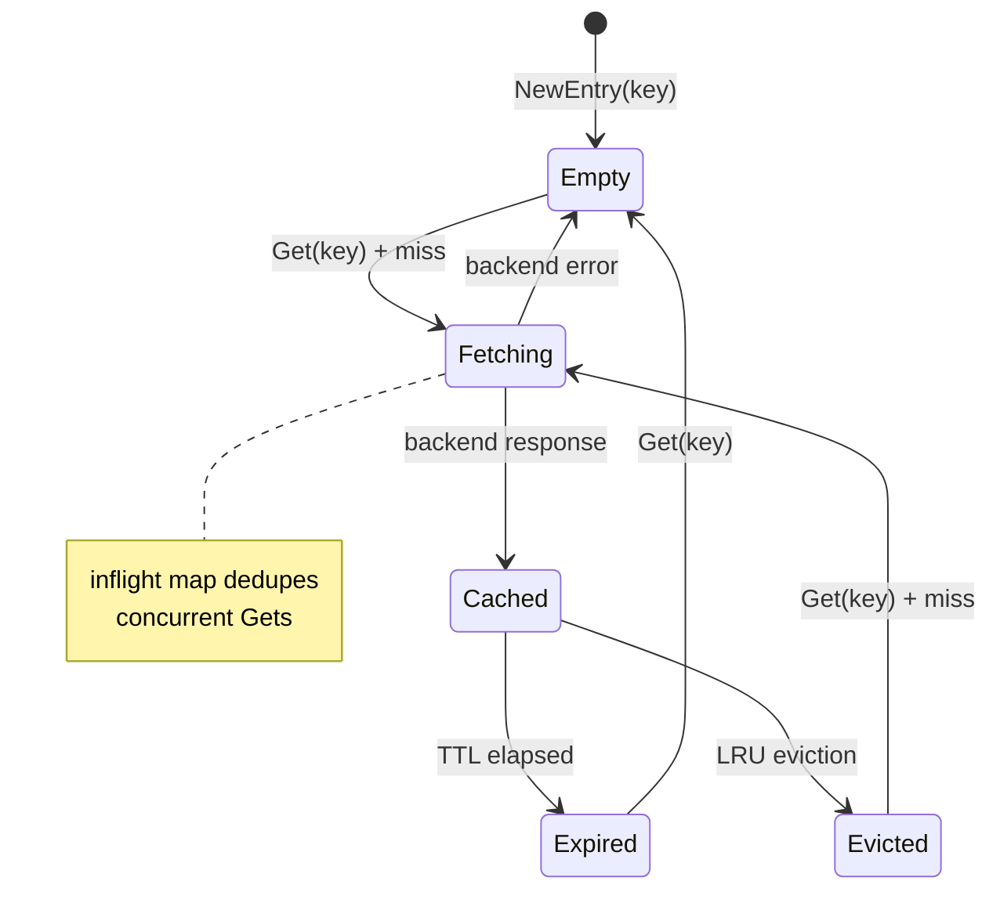

**Anti-pattern:** using a sequence diagram for lifecycle — sequence shows messages, state shows states.

---

## Pattern 7 — Migration path

**Question:** *How do we get from old to new?*

Three subgraphs in order: Before → Flagged → After. Makes rollout states impossible to confuse.

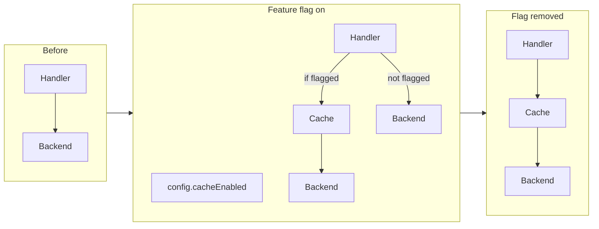

**Tip:** a dashed edge into a phantom node (`X[" "]`) communicates "this path is gone" without prose.
**Anti-pattern:** describing the rollout in prose only — the three subgraphs make the states visually distinct.

---

## Combining patterns in one doc

A typical PR description uses 3–5 patterns interleaved with prose:

```markdown
## Context
[2–3 lines: what's the problem?]

## Proposed change
[2–3 lines: what's the new shape?]

### Layering        ← Pattern 1: who owns what
[diagram]

### Data flow       ← Pattern 2: what does the request look like
[diagram]

### Hot path        ← Pattern 3: concurrency
[diagram]

### Lifecycle       ← Pattern 6: cache entry states
[diagram]

### Rollout         ← Pattern 7: Before → Flagged → After
[diagram]
```

**Rule:** one diagram per *question*, not per artifact or code module.
Pair every diagram with a 1–2 sentence caption.

---

## Observability templates

**Request trace (L3):**
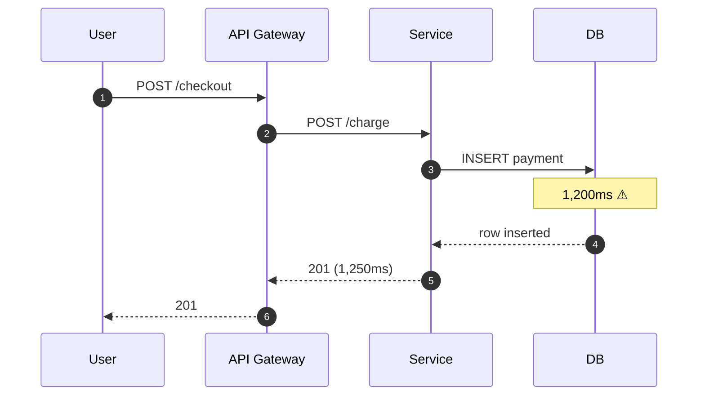

**Incident timeline (L1 logs):**
```mermaid
gantt
    title Incident timeline
    dateFormat HH:mm
    axisFormat %H:%M
    section Detection
        Alert fired        :done, a1, 14:02, 2m
        On-call paged      :done, a2, after a1, 1m
    section Investigation
        Identified DB lock  :done, a3, after a2, 18m
    section Mitigation
        Killed long queries :crit, a4, after a3, 5m
        Traffic recovered   :done, a5, after a4, 3m
```

**Alert routing chain:**
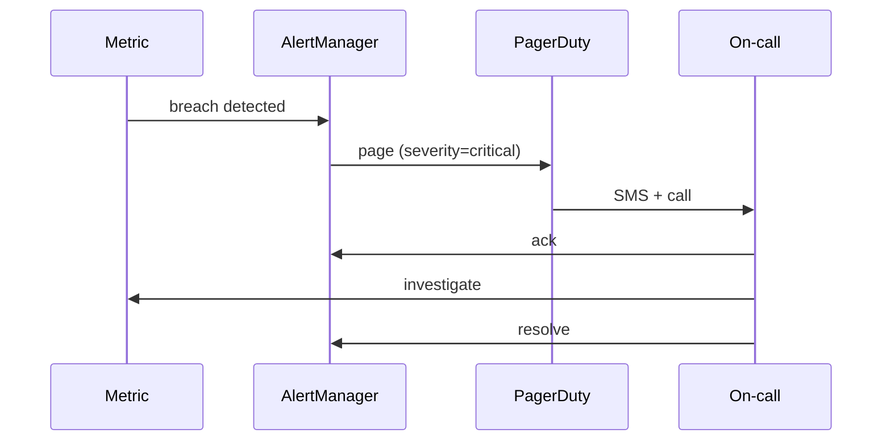

**SLO tree:**
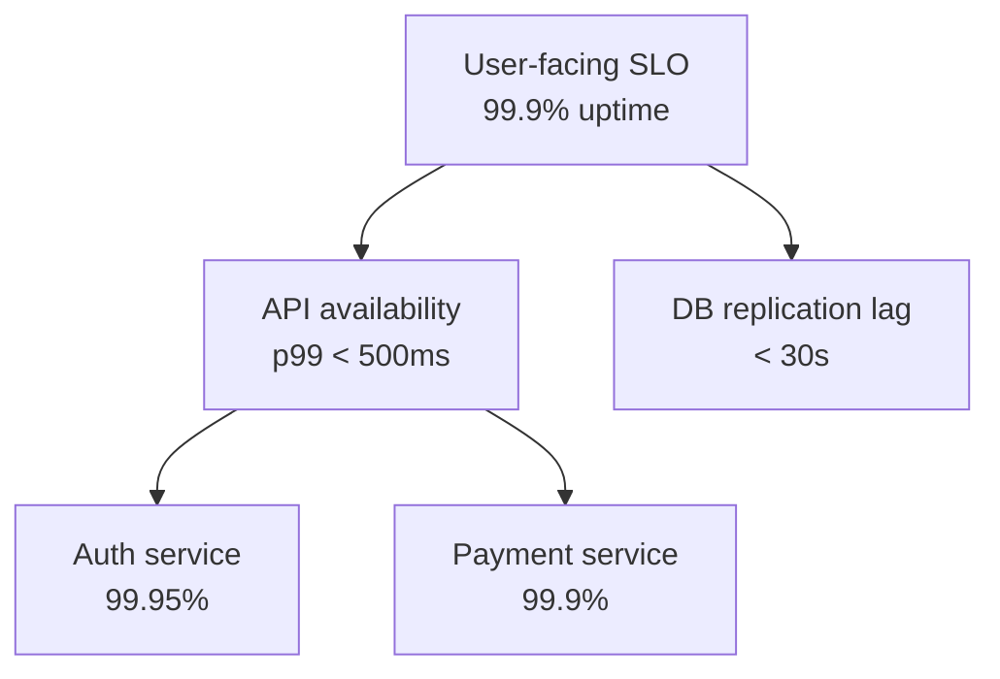
