# Mermaid Syntax Quick Reference

Condensed from the official Mermaid docs at `mermaid.js.org/syntax/*`.
Library version: `mermaid@11.16.0`.

---

## Flowchart — `flowchart` (alias: `graph`)

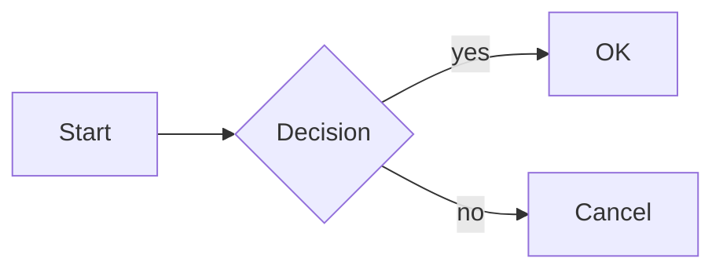

**Directions:** `TB` / `TD` (top→bottom), `BT`, `LR` (left→right), `RL`

**Node shapes:**
- `[rect]` `(round)` `([stadium])` `[[subroutine]]` `[(cylinder)]` `((circle))`
- `>asym]` `{diamond}` `{{hexagon}}` `[/parallelogram/]` `[\trap\]` `[/trap/]`

**Edges:**
- `---` line, `-->` arrow, `-.->` dotted, `==>` thick
- `--text-->` or `-->|text|` labeled
- `---o` circle end, `---x` cross end, `<-->` bidirectional

**Subgraphs:** `subgraph id[Title] ... end`

**Styling:**
```
classDef myStyle fill:#9f9,stroke:#333
class NodeA myStyle
NodeA:::myStyle
```

---

## Sequence — `sequenceDiagram`

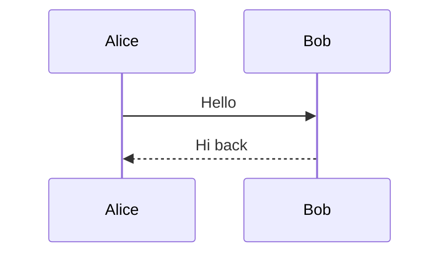

**Arrows:**
| Syntax | Meaning |
|--------|---------|
| `->` | solid line, no arrowhead |
| `-->` | dotted line, no arrowhead |
| `->>` | solid arrow |
| `-->>` | dotted arrow |
| `<<->>` | solid bidirectional (v11.0.0+) |
| `<<-->>` | dotted bidirectional (v11.0.0+) |
| `-x` | solid cross end |
| `--x` | dotted cross end |
| `-)` | async open arrow (solid) |
| `--)` | async open arrow (dotted) |

**Control blocks:**
```
alt Happy path
  A->>B: ok
else Error
  A->>B: retry
end

opt Only if auth
  ...
end

loop Retry 3x
  ...
end

par Concurrent
  A->>B: send
and
  A->>C: send
end

break On failure
  ...
end
```

**Notes:** `Note over A,B: text` · `Note right of A: text`
**Autonumber:** `autonumber` at top of diagram
**Activations:** `A->>+B: ...` / `B-->>-A: ...`

---

## State — `stateDiagram-v2`

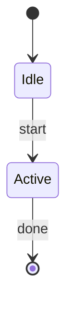

**Composite states:** `state Parent { ... }`
**Notes:** `note right of Active : text`
**Concurrency:** `state Fork <<fork>>` / `state Join <<join>>`

---

## Class — `classDiagram`

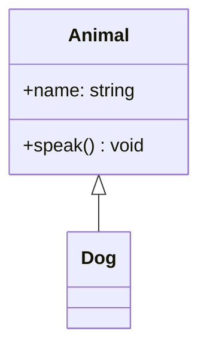

**Visibility:** `+` public · `-` private · `#` protected · `~` package
**Stereotypes:** `<<interface>>` `<<abstract>>` `<<service>>` `<<enumeration>>`
**Relationships:** `<|--` inheritance · `*--` composition · `o--` aggregation · `-->` association · `..|>` realization · `..>` dependency

---

## ER — `erDiagram`

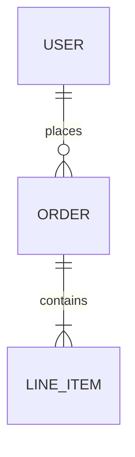

**Cardinality:**
- `|o` / `o|` — zero or one
- `||` / `||` — exactly one
- `}o` / `o{` — zero or more
- `}|` / `|{` — one or more

`||--|{` = identifying · `||--o{` = non-identifying

**Attributes:**
```
ENTITY {
  type name PK
  type name FK
  type name UK
}
```

---

## Gantt — `gantt`

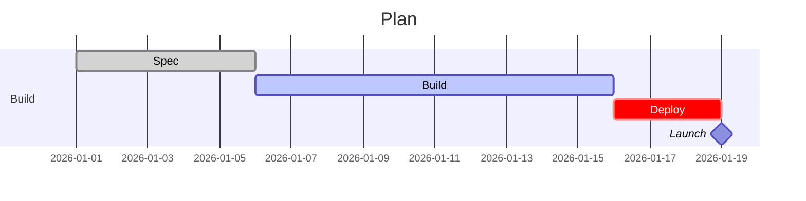

**Date formats:** `YYYY-MM-DD` · `HH:mm` for time-of-day
**Axis format:** `axisFormat %H:%M` or `axisFormat %b %d`
**Tags:** `done` · `active` · `crit` · `milestone`
**Dependencies:** `after taskId`
**Excludes:** `excludes weekends` or `excludes 2026-01-01`
**Duration units:** `ms`, `s`, `m`, `h`, `d`, `w`, `M`, `y`

---

## Timeline — `timeline`

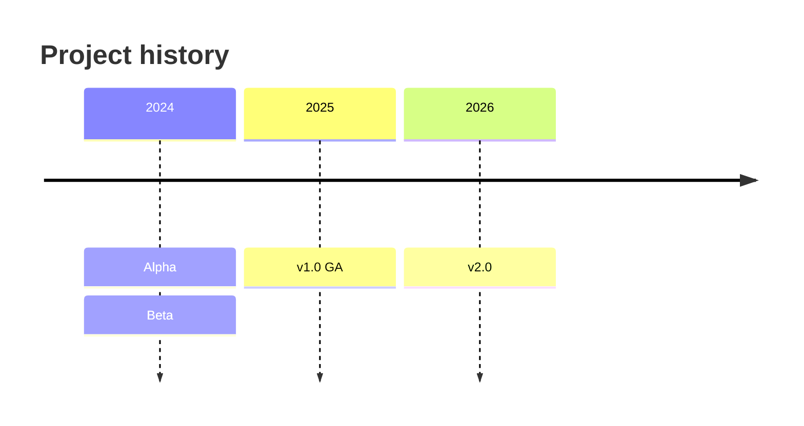

---

## Gitgraph — `gitGraph`

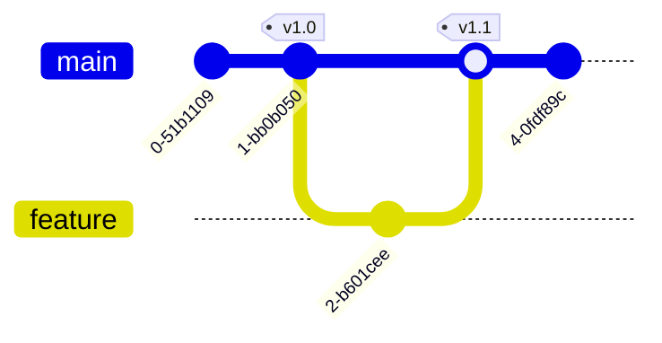

**Operations:** `commit [id:"x"] [tag:"v"] [type: NORMAL|REVERSE|HIGHLIGHT]`
`branch name` · `checkout name` · `merge name [tag]` · `cherry-pick id:"..."`

---

## XY Chart — `xychart-beta`

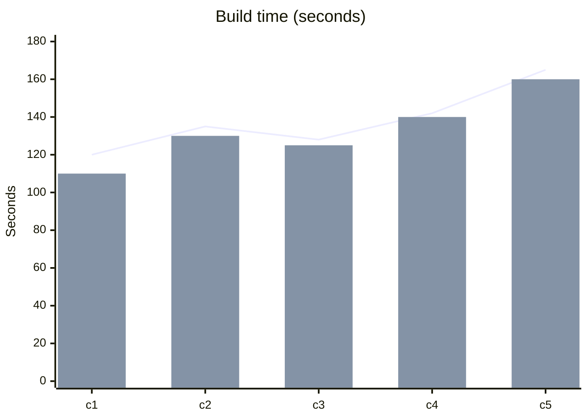

One `line [...]` or `bar [...]` per series.

---

## Sankey — `sankey-beta`

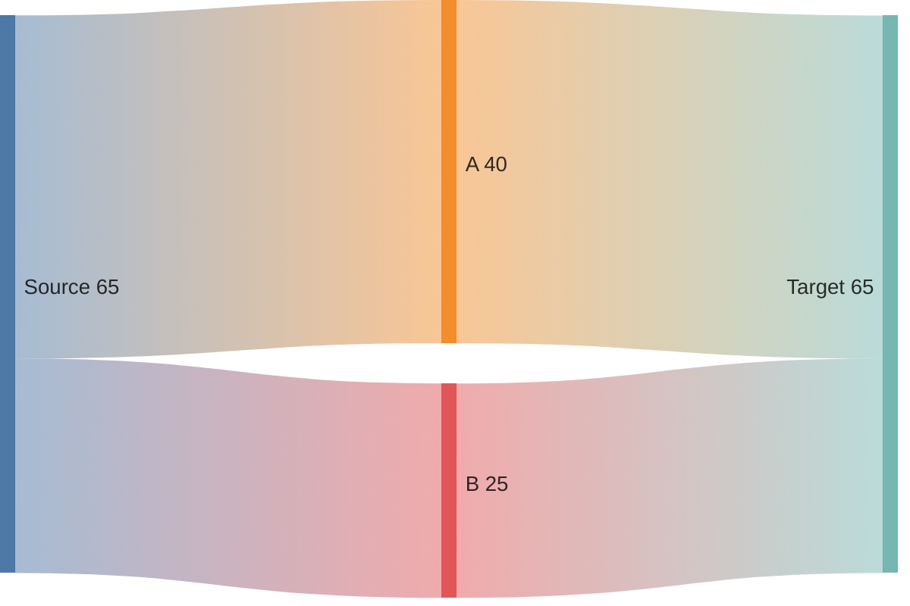

CSV rows: `from,to,value`

---

## Radar — `radar-beta` (v11.6.0+)

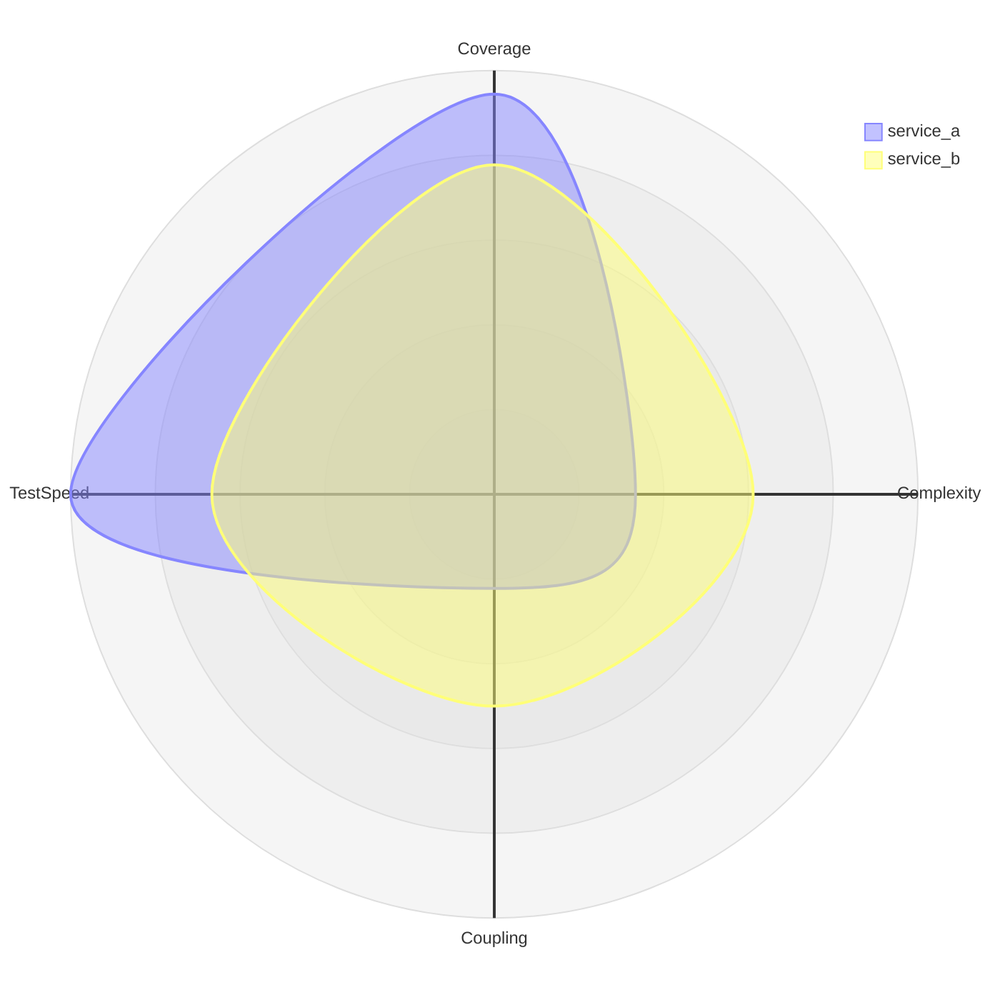

---

## Pie — `pie`

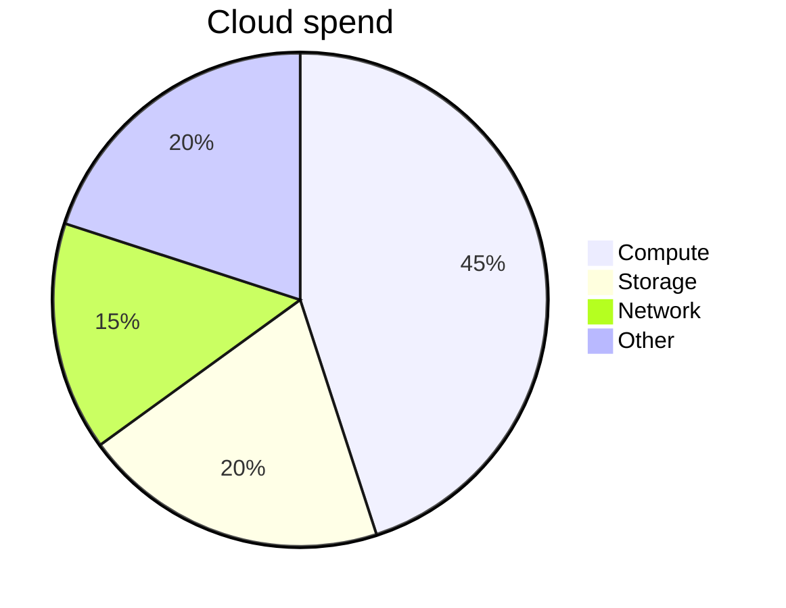

---

## Mindmap — `mindmap`

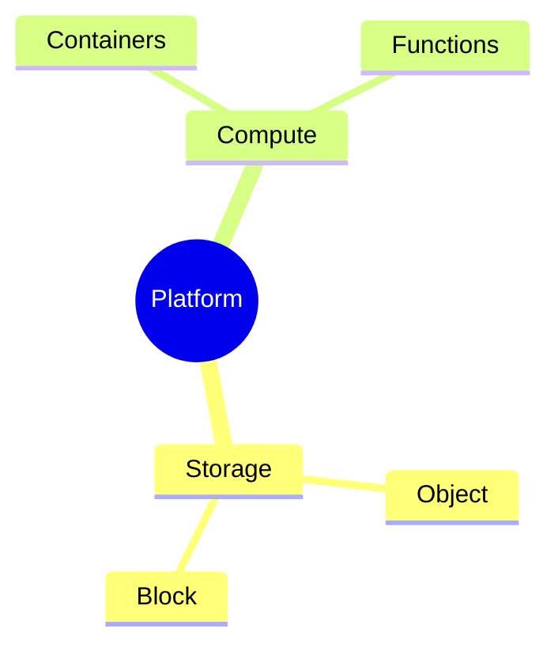

Indentation = hierarchy. Shape prefixes for root: `((circle))` `)box(` `)rounded(`

---

## Quadrant — `quadrantChart`

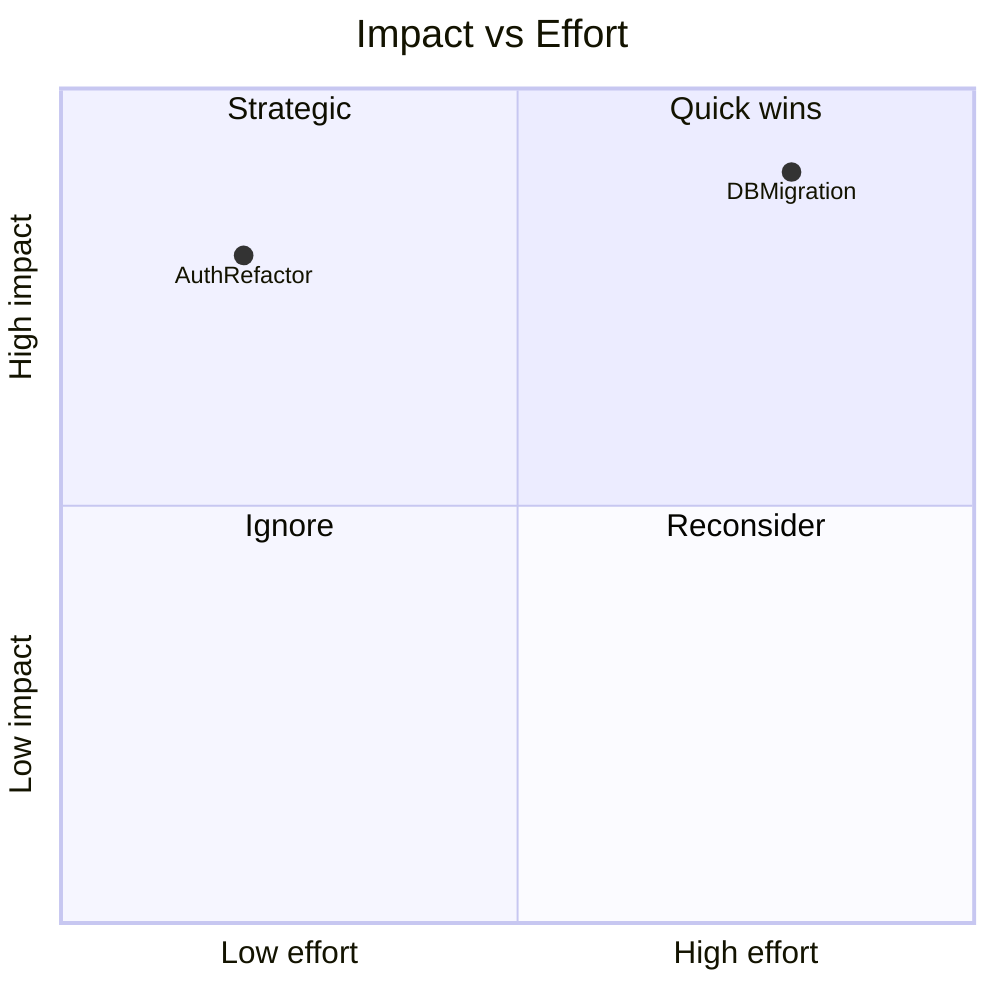

Points are `[x, y]` in 0–1 range.

---

## Kanban — `kanban`

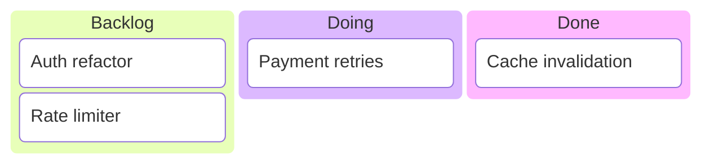

---

## Packet — `packet-beta` (v11.0.0+)

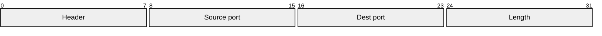

---

## Requirement — `requirementDiagram`

```mermaid
requirementDiagram
  requirement sla {
    id: 1
    text: 99.9% uptime monthly
    risk: high
    verifyMethod: measurement
  }
  functionalRequirement p99 {
    id: 2
    text: p99 < 500ms
  }
  sla - contains -> p99
```

---

## C4 — `C4Context` / `C4Container` / `C4Component`

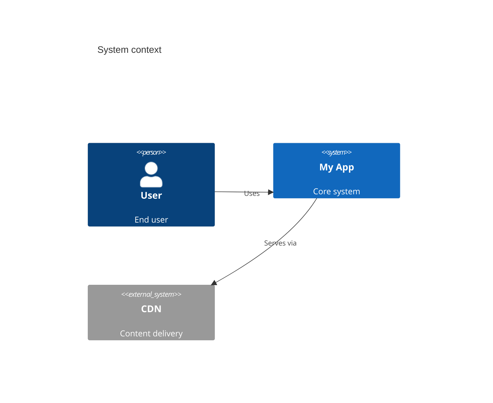

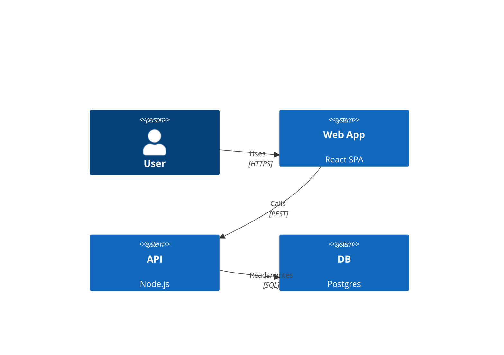

---

## Architecture — `architecture-beta` (v11.1.0+)

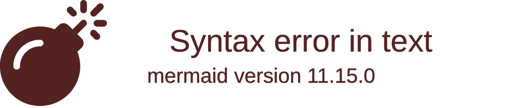

Icons: `server`, `database`, `disk`, `internet`, `cloud`

---

## Block — `block-beta`

```mermaid
block-beta
  columns 3
  A B C
  D E F
  G --> H
  classDef done fill:#9f9,stroke:#333
  class G done
```

---

## Configuration (frontmatter — v10.5.0+)

```mermaid
---
config:
  theme: dark
  themeVariables:
    primaryColor: "#bb2525"
  flowchart:
    curve: basis
---
flowchart LR
  A --> B
```

**Themes:** `default` · `dark` · `forest` · `neutral` · `base`

---

## Common errors

| Symptom | Likely cause | Fix |
|---------|-------------|-----|
| "Syntax error" near an arrow | Reserved word as bare node ID | Quote it: `A["end"]` |
| Diagram doesn't render on host | Host doesn't support that type | Fall back to `flowchart` |
| `&` in labels breaks parsing | Confused with HTML entity | Use `&amp;` or reword |
| Quotes inside labels | Parser confusion | Use `#quot;` or avoid |
| Blank re-render | `mermaid.run()` called twice | Use `startOnLoad: true` only |
